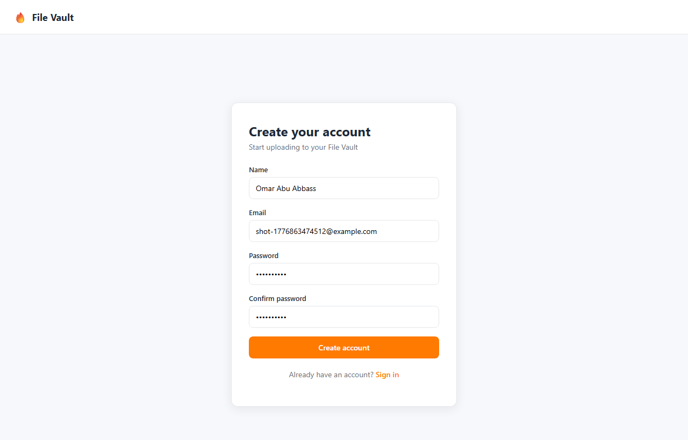
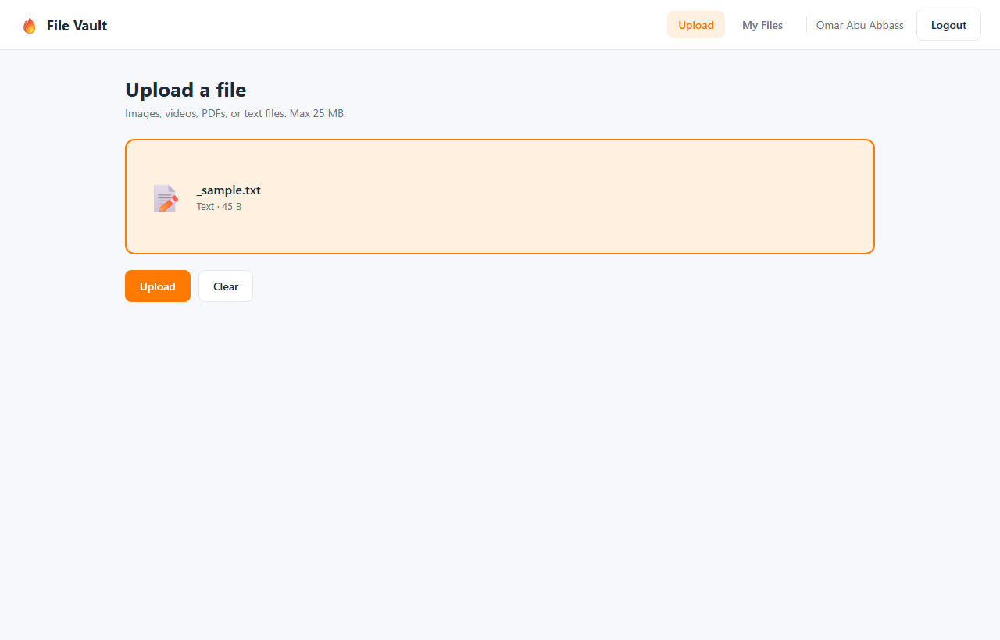
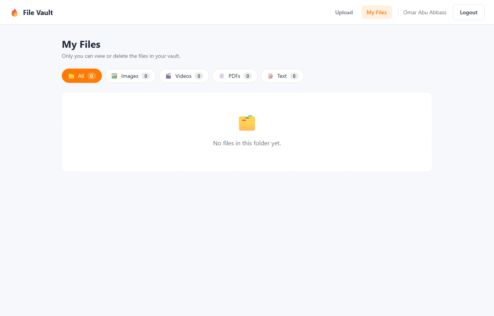
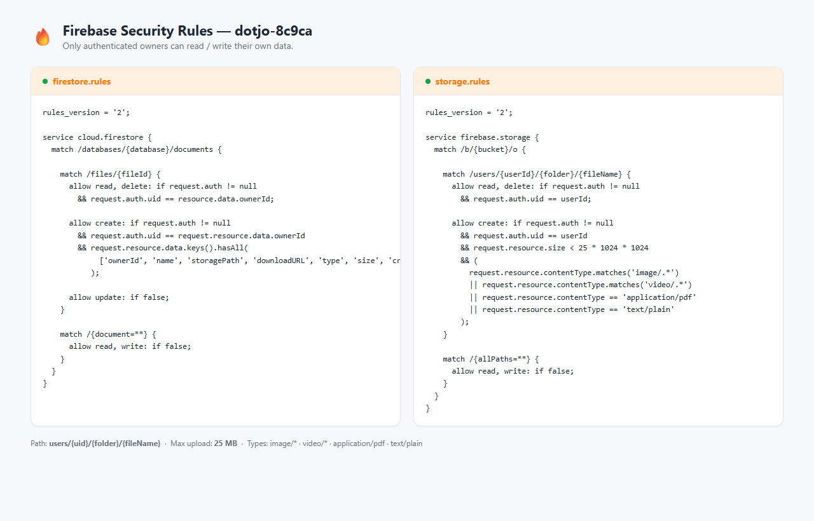

# 🔥 Firebase File Vault

A personal file-storage web app built on **Firebase** as a Backend-as-a-Service.
Each user can register, log in, upload files, and view or delete **only** the
files they own — enforced by Firebase security rules.

> **Live demo:** https://dotjo-8c9ca.web.app &nbsp;·&nbsp; _(replace with your
> own deploy URL if different)_

---

## Description

File Vault is a multi-user "personal cloud" where every signed-in user gets an
isolated folder. Files are stored in Firebase Storage, metadata lives in
Cloud Firestore, authentication is handled by Firebase Authentication, and the
whole SPA is served from Firebase Hosting. No custom backend server is needed.

---

## Firebase Services Used

| Service                     | What it's used for                                        |
| --------------------------- | --------------------------------------------------------- |
| **Firebase Authentication** | Email/password sign-up and sign-in                        |
| **Cloud Firestore**         | Stores file metadata (owner, name, type, size, URL)       |
| **Firebase Storage**        | Stores the actual uploaded files under `users/{uid}/...`  |
| **Firebase Hosting**        | Serves the built React SPA                                |

---

## Screenshots

| Register | Upload (file selected) |
| -------- | ---------------------- |
|  |  |

| My Files | Security Rules |
| -------- | -------------- |
|  |  |

Full screenshots folder: [`screenshots/`](screenshots/).

---

## Tech Stack

| Layer        | Technology                          |
| ------------ | ----------------------------------- |
| Frontend     | React 18, React Router, Vite        |
| Auth         | Firebase Authentication             |
| Database     | Cloud Firestore                     |
| File Storage | Firebase Storage                    |
| Hosting      | Firebase Hosting                    |

---

## Project Structure

```
Task-34_Backend_as_a_Service_(BaaS)_Firebase_Omar_Abu_Abbass/
├── firebase.json           # Hosting, Firestore, Storage config
├── .firebaserc             # Firebase project alias
├── firestore.rules         # Firestore security rules
├── storage.rules           # Storage security rules
├── index.html
├── package.json
├── vite.config.js
├── screenshots/            # README screenshots
└── src/
    ├── firebaseConfig.js   # Firebase SDK initialization
    ├── fileTypes.js        # Folder definitions and helpers
    ├── main.jsx
    ├── App.jsx             # Router
    ├── index.css
    ├── context/
    │   └── AuthContext.jsx # Auth state provider
    ├── components/
    │   ├── Navbar.jsx
    │   ├── ProtectedRoute.jsx
    │   └── Loader.jsx
    └── pages/
        ├── Login.jsx
        ├── Register.jsx
        ├── Upload.jsx      # File upload with progress
        └── Files.jsx       # Folder view + delete
```

---

## Running Locally

### 1. Create a Firebase project

1. Go to [Firebase Console](https://console.firebase.google.com/) → **Add project**.
2. Click the **`</>`** icon to register a web app. Copy the `firebaseConfig`.
3. In the console, enable:
   - **Build → Authentication → Sign-in method → Email/Password**
   - **Build → Firestore Database** (create in production mode)
   - **Build → Storage** (create a default bucket)

### 2. Configure the app

```bash
npm install
```

Paste your config into [`src/firebaseConfig.js`](src/firebaseConfig.js) and set
your project ID in [`.firebaserc`](.firebaserc).

### 3. Start the dev server

```bash
npm run dev
```

The app runs on `http://localhost:5173`.

---

## Deployment (Firebase Hosting)

Install the Firebase CLI once:

```bash
npm install -g firebase-tools
firebase login
```

Then from this folder:

```bash
npm run build                            # builds to dist/
firebase deploy                          # deploys everything
```

`firebase deploy` publishes:

- built frontend (`dist/`) → **Hosting**
- `firestore.rules` → **Firestore**
- `storage.rules` → **Storage**

Deploy a single target if needed:

```bash
firebase deploy --only hosting
firebase deploy --only firestore:rules
firebase deploy --only storage
```

---

## Rules & Permissions

Security is **enforced on the server** by Firebase rules, not just in the UI.

### Firestore — [`firestore.rules`](firestore.rules)

- `create`: only an authenticated user can create a `files` document, and only
  for themselves (`request.auth.uid == request.resource.data.ownerId`).
  Required fields are enforced with `hasAll(...)`.
- `read`, `delete`: only the document owner (`request.auth.uid == resource.data.ownerId`).
- `update`: disabled — metadata is immutable.
- Any other collection is denied by default.

### Storage — [`storage.rules`](storage.rules)

- Files live at `users/{uid}/{folder}/{fileName}`.
- `read`, `delete`, `create`: only when `request.auth.uid == userId`.
- `create` additionally checks:
  - `request.resource.size < 25 MB`
  - `contentType` is `image/*`, `video/*`, `application/pdf`, or `text/plain`.
- Everything else is denied.

**Effect:** a user can never list, read, or delete another user's files, even
if they craft a request manually — the rules reject it.

---

## Extras Implemented

- ✅ Video uploads with inline previews
- ✅ Folder-style filtering on the **My Files** page (All / Images / Videos /
  PDFs / Text) with live counts
- ✅ Drag-and-drop upload with a live progress bar
- ✅ Real-time list updates via Firestore `onSnapshot` — new uploads and
  deletes appear instantly without a refresh

---

## Author

**Omar Abu Abbass**
